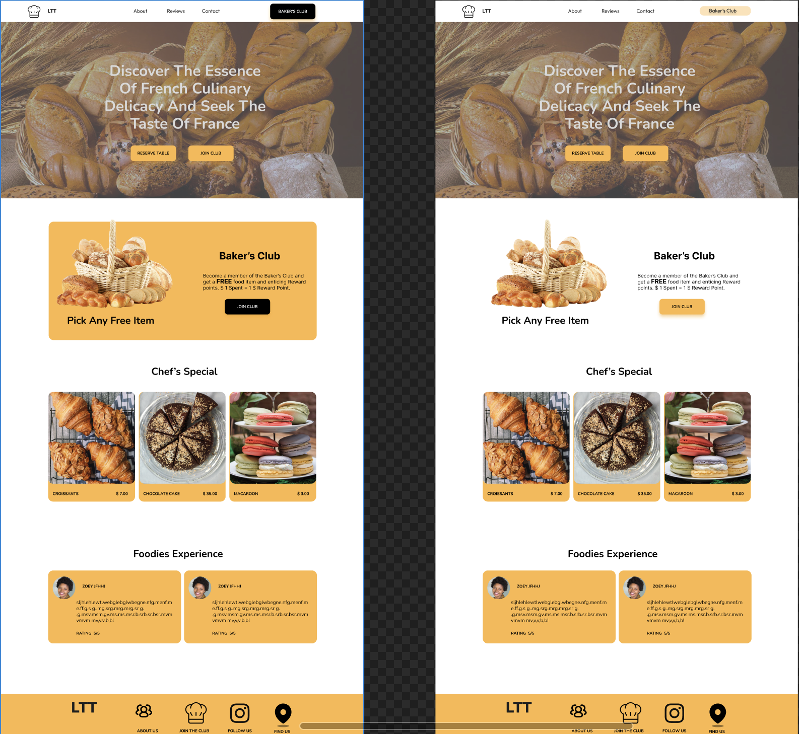
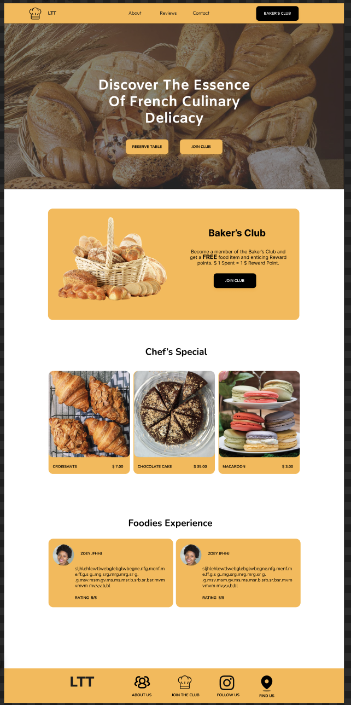
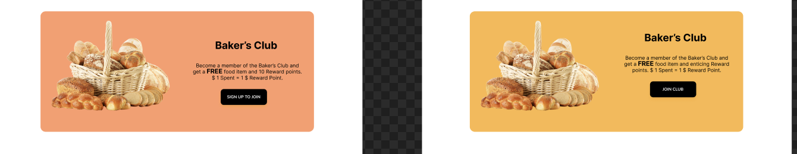
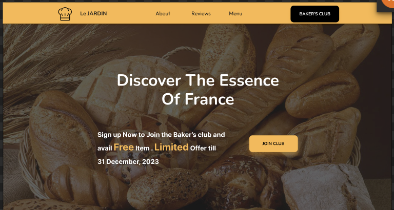
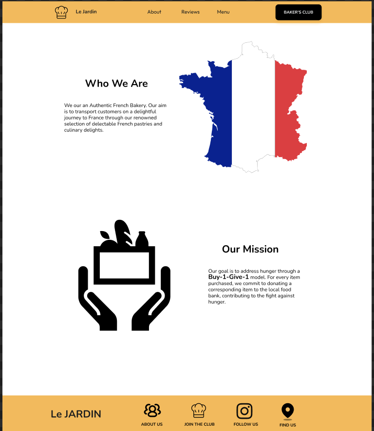
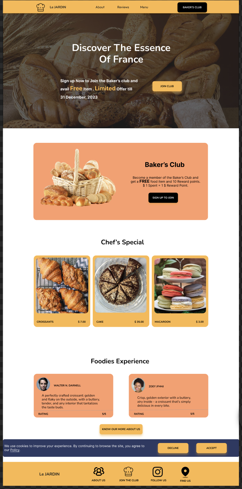
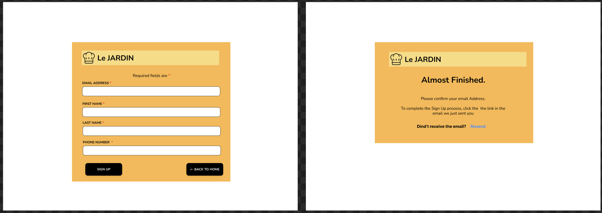

# UX Research Report

## Archetype for Website:

### Explorer:
- Description: The Explorer is adventurous, want to experience new things, experience the french flavour.
- Color: Earth tones, green red, yellow, hence we have picked a shade of yellow as an overall theme.
- ypography: Bold, adventurous fonts (e.g., Futura, Avenir, Nunito)
- Images: Landscapes, nature, and travel images.

## Initial 2 designs:

### Manual Testing Round 1:
- Manual testing of the initial design and the feedback. Testing protocol used A/B testing, "Think Out Loud," and the "5 second protocol."

#### Tester - Brijesh:

##### 5 Second Test:
- Header text is not properly visible.
- The rest of the site has an earthy tone.
- The word "Discover" suggests that the archetype is 'Explorer.'

##### A/B Testing:
- "Baker’s Club" with a colored background seems better than the one without any background.
- Dark navigation button is better than the light one.

##### Think Out Loud:
- The site looked professional, and the user was able to tell that it was for a bakery.
- The  Archetype 'Explorer' was personified through the color, font, and video in the background.
- Brijesh was able to find the 'Join Baker’s Club' button in the nav bar and in the hero section.

#### Tester - Nachiket:

##### 5 Second Test:
- Header text is too long. Too many words.
- The Baker’s club background seems empty and appears to be in the air.

##### A/B Testing:
- "Baker’s Club" with a colored background seems better than the one without any background.

##### Think Out Loud:
- Easily accessed the 'menu' and specialty items through the nav bar.
- To learn more about the business, the tester found the 'about' link in the nav bar.
- Suggested reducing the footer height.

## Design after Round 1 feedback:

### Manual Testing Round 2:
- Conduct manual testing round 2 of the Figma design and note down the feedback. Your testing protocol should use both A/B testing, "Think Out Loud," and the "5 second protocol."

#### Tester - Brijesh:

##### 5 Second Test:
- The website looks more professional than last time.
- Hero text and Hero video in the background fit the Explorer archetype.

#### A/B Testing:
- Already done in Round 1 of manual design testing.

#### Think Out Loud:
- Add a different color background for Testimonials and Baker’s Club to add color to the site.

#### Tester - Brijesh:

##### 5 Second Test:
- The website has an aesthetic appeal.
- The navigation bar is improved with a background color.

#### A/B Testing:
- Already done in Round 1 of manual design testing.

#### Think Out Loud:
- Suggest adding a button for 'about us' in the testimonials section to provide users with a quick glimpse of your mission and team, in addition to reading reviews.

## Design changes after Round 2 feedback:

 

### Design Feedback from Professor:

#### Change Hero Section:
- Reduce the number of words in the hero text.
- Add subtext with a method of persuasion to encourage customers to sign up.

#### Reduce Text:
- Minimize the text in the 'About Us' section.
- Reduce the text in the 'Our Mission' section.

## Design changes after Professor's feedback:

 

## Final Designs:

 

## Signup and confirmation page Design:

## Lighthouse Testing:

### Summary:
- Perform Lighthouse testing to check the lighthouse score of the index page and additional page.

### Acceptance criteria:
1.Check the Performance score on the lihghthouse chrome in developer tools, Accessibility, Best Practice, SEO
2.Check Accessibility score on the lihghthouse chrome in developer tools
3.Check Best Practice score on the lihghthouse chrome in developer tools
4.Check SEO score on the lihghthouse chrome in developer tools. 
5.All should be above Score 90.

